# PeakForm

## A full-stack fitness web application where users can create profiles, browse and enroll in training plans, and track their workout progress over time.

## Code Institute - Milestone Project 4

## HTML / CSS / JavaScript / Python / Django / SQLite - Full Stack Development Milestone Project 4.

### By RobMaty

[View Live Site](https://peak-form-iota.vercel.app/)

---

## Table of Content

* [The Why](#the-why)
* [The Business Goal](#the-business-goal)
* [(UX) User Experience](#ux-user-experience)
  + [User Stories](#user-stories)
    - [First time Users Goals](#first-time-users-goals)
    - [Returning Users Goals](#returning-users-goals)
    - [Frequent Users Goals](#frequent-users-goals)
    - [Website Owner Goals](#website-owner-goals)
* [Design](#design)
  + [Theme and Colour Scheme](#theme-and-colour-scheme)
  + [Design Brief](#design-brief)
* [Wireframes](#wireframes)
* [Features](#features)
  - [Existing Features](#existing-features)
    * [Landing Page](#landing-page)
    * [Authentication](#authentication)
    * [Training Plans](#training-plans)
    * [Plan Detail](#plan-detail)
    * [Purchase Flow](#purchase-flow)
    * [Progress Dashboard](#progress-dashboard)
* [Technologies](#technologies)
  + [Languages used](#languages-used)
  + [Frameworks, Libraries and Programs used](#frameworks-libraries-and-programs-used)
* [Database Schema](#database-schema)
  + [Schema](#schema)
* [Testing](#testing)
  + [Validator Testing](#validator-testing)
  + [Lighthouse Performance](#lighthouse-performance)
  + [Manual Testing](#manual-testing)
* [Deployment](#deployment)
  + [Inception](#inception)
  + [Local Clone](#local-clone)
  + [Forking repository](#forking-repository)
* [Credits](#credits)
* [Tutorials, guides and course resources](#tutorials-guides-and-course-resources)
* [Acknowledgements](#acknowledgements)

---

## The Why

Help users stay consistent with their fitness journey by giving them a centralised platform to discover structured training plans, enroll in them, and log every workout session so they can measure real progress over time.

## The Business Goal

+ Grow the user base by offering free entry-level training plans.
+ Convert free users into paying customers through premium plans.
+ Build a library of coach-created plans that coaches can sell directly through the platform.

---

## (UX) User Experience

Users can navigate the application intuitively from landing page through to plan discovery, enrollment, and daily workout logging with minimal friction.

- ### User Stories

  - #### First time Users Goals
     - To understand what PeakForm offers at a glance.
     - To register quickly and set up a personal profile.
     - To browse available training plans and filter by level.
     - To enroll in a free plan without needing payment details.

  - #### Returning Users Goals
     - To log into their account and land directly on their dashboard.
     - To view their active training plans and today's exercises.
     - To log a completed workout and track sets, reps, and weight.
     - To monitor their body weight trend over time.

  - #### Frequent Users Goals
     - To see their workout history and progress charts on the dashboard.
     - To upgrade to a premium plan as their fitness level grows.
     - To update their profile goal and body metrics.

  - #### Website Owner Goals
     - To add and manage training plans through the Django admin.
     - To assign exercises to specific days within a plan.
     - To distinguish free plans from paid plans with clear pricing.
     - To view enrolled users per plan.

---

## Design

### Theme and Colour Scheme

The theme is inspired by peak athletic performance — clean, focused, and energetic. The design uses a dark base with high-contrast accent colours to create a modern fitness aesthetic that motivates users to take action.

A minimal and bold colour scheme was chosen to communicate strength and discipline. Utility classes are applied consistently from a single CSS file to maintain visual coherence across all pages.

### Design Brief

+ Colour:

  A dark background with a vibrant primary accent communicates energy without visual noise. Secondary text uses muted tones to create clear hierarchy.

+ Images:

  Plan card images are sourced via URL and represent the physical discipline each plan targets (strength, cardio, flexibility, etc.).

+ Typography:

  A clean sans-serif font stack is used throughout to keep the interface readable and modern.

---

## Wireframes

The basic structure of PeakForm was sketched using [Balsamiq](https://balsamiq.com/).

- Landing Page (Desktop)
- Plans List (Desktop / Tablet / Mobile)
- Plan Detail Page
- Progress Dashboard
- Login / Register Forms

---

## Features

- ### Existing Features

  - #### Landing Page

    A bold hero section introduces PeakForm with a clear call-to-action to get started or discover plans. The headline immediately communicates the core value proposition. Below the hero, The Kinetic Feed section displays editorial fitness content to engage and educate users.

    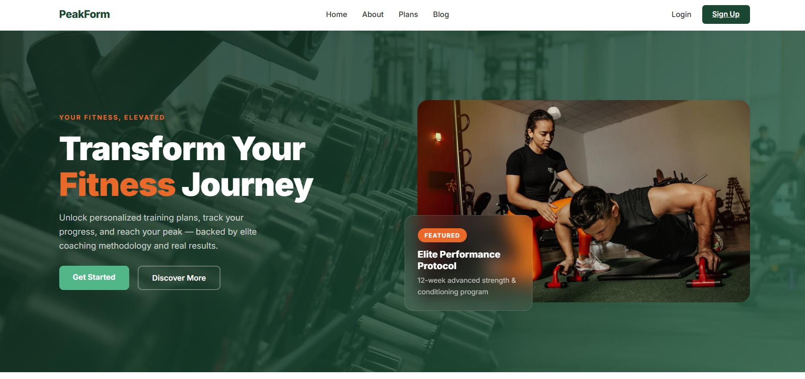

    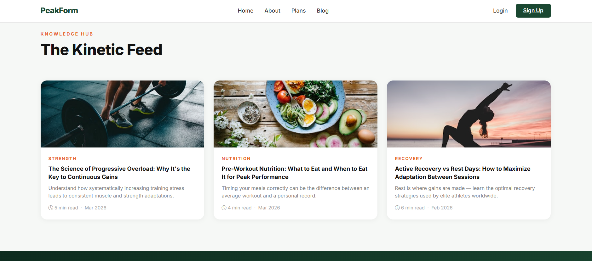

  - #### Authentication

    Users can register with a username, email, and password. Login and logout are handled securely via Django's built-in authentication. The login page is designed with a split layout featuring key selling points alongside the form.

    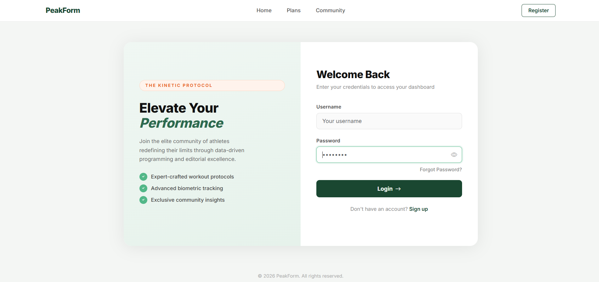

  - #### Training Plans

    All available plans are displayed as cards showing the plan title, level badge (Beginner / Intermediate / Advanced), duration in weeks, and price. Free plans are clearly labelled. Paid plans show their price. Users can search plans by name.

    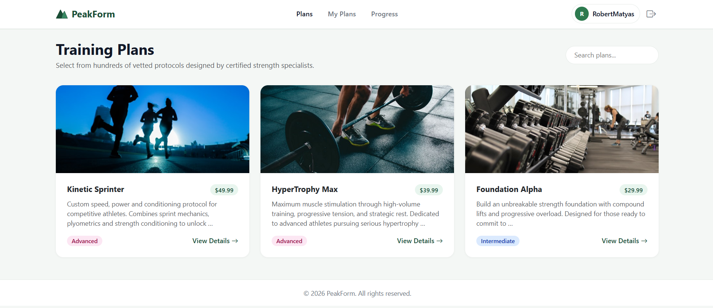

  - #### Plan Detail

    Clicking a plan opens a detail page with the full description, pricing, and exercise schedule. Exercises are grouped by day of the week and show sets, reps, rest time, and notes. A purchase button allows users to enroll in the plan.

    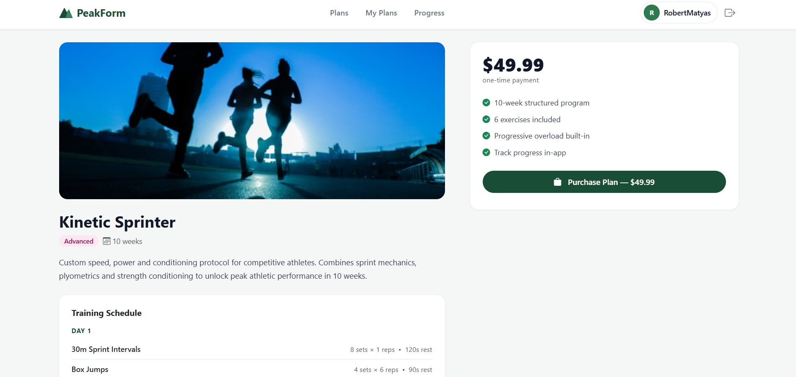

  - #### Purchase Flow

    Paid plans trigger a secure purchase modal where users enter their card details to complete the transaction before gaining access to the plan.

    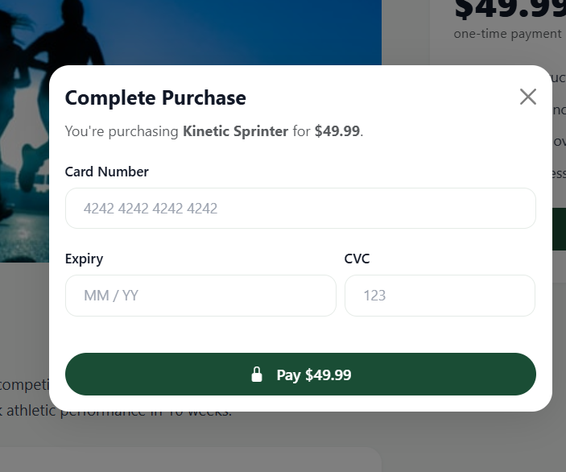

  - #### Progress Dashboard

    The dashboard shows a body weight trend chart with 7-day, 1-month, and all-time views. Users can log their current weight directly from the dashboard. A workouts panel on the right tracks all logged sessions.

    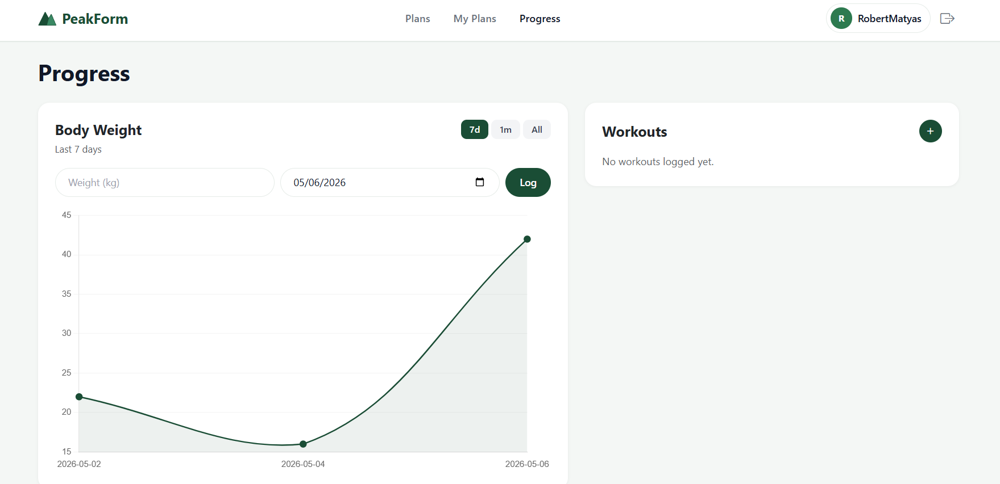

---

## Technologies

### Languages used

- [HTML5](https://en.wikipedia.org/wiki/HTML5)
- [CSS3](https://en.wikipedia.org/wiki/CSS)
- [JavaScript](https://en.wikipedia.org/wiki/JavaScript)
- [Python 3](https://en.wikipedia.org/wiki/Python_(programming_language))

### Frameworks, Libraries and Programs used

- [Django](https://www.djangoproject.com/) — main web framework (models, views, templates, ORM)
- [Bootstrap 5](https://getbootstrap.com/) — responsive layout and UI components
- [django-crispy-forms](https://django-crispy-forms.readthedocs.io/) — form rendering with Bootstrap 5 styling
- [Pillow](https://python-pillow.org/) — image processing for avatar uploads
- [python-dotenv](https://pypi.org/project/python-dotenv/) — environment variable management
- [SQLite](https://sqlite.org/) — development database
- [Git](https://git-scm.com/) — version control
- [GitHub](https://github.com/) — repository hosting
- [Balsamiq](https://balsamiq.com/) — wireframing

---

## Database Schema

### Schema

PeakForm uses Django's ORM with SQLite in development. The schema is composed of five core models across three Django apps.

**accounts app**

| Model   | Fields |
|---------|--------|
| Profile | user (FK User), bio, avatar, goal, weight, height, created_at |

**plans app**

| Model    | Fields |
|----------|--------|
| Plan     | title, description, level, duration_weeks, price, is_free, image_url, created_by (FK User), created_at |
| Exercise | plan (FK Plan), name, sets, reps, rest_seconds, day_of_week, notes |
| UserPlan | user (FK User), plan (FK Plan), enrolled_at, is_active |

**progress app**

| Model       | Fields |
|-------------|--------|
| WorkoutLog  | user (FK User), plan (FK Plan), date, notes, completed, created_at |
| ExerciseLog | workout_log (FK WorkoutLog), exercise (FK Exercise), exercise_name, sets_done, reps_done, weight_kg |
| BodyWeight  | user (FK User), weight_kg, date, created_at |

---

## Testing

### Validator Testing

Site-wide HTML and standards validation was carried out using [PowerMapper SortSite](https://www.powermapper.com/products/sortsite/). The tool scanned all 17 pages and files across the application and reported 0 broken links or errors. Standards compliance scored well above average (6% issues vs benchmark).

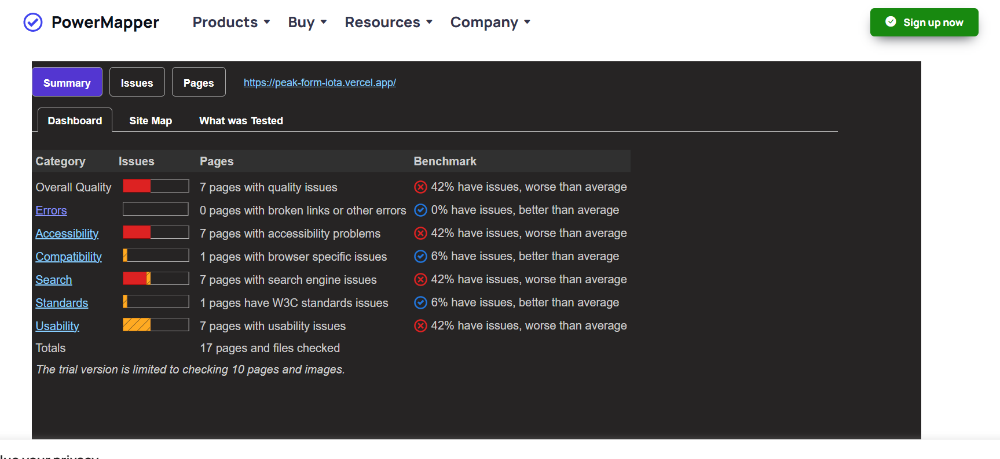

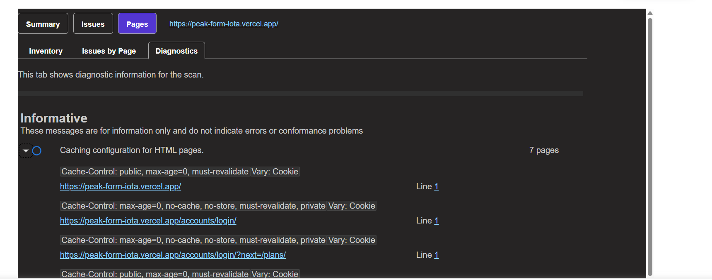

CSS was additionally validated using the [W3C CSS Validation Service](https://jigsaw.w3.org/css-validator/).

### Lighthouse Performance

Performance was measured using [Google PageSpeed Insights](https://pagespeed.web.dev/) on the landing page.

**Mobile Results**

| Category       | Score |
|----------------|-------|
| Performance    | 73    |
| Accessibility  | 74    |
| Best Practices | 100   |
| SEO            | 91    |

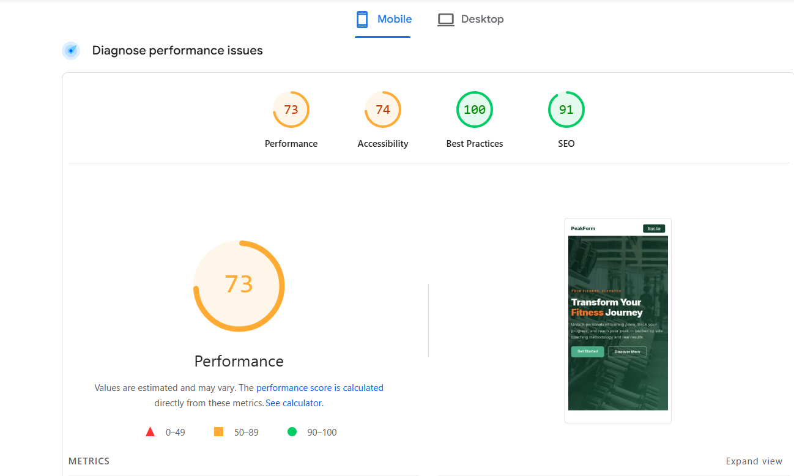

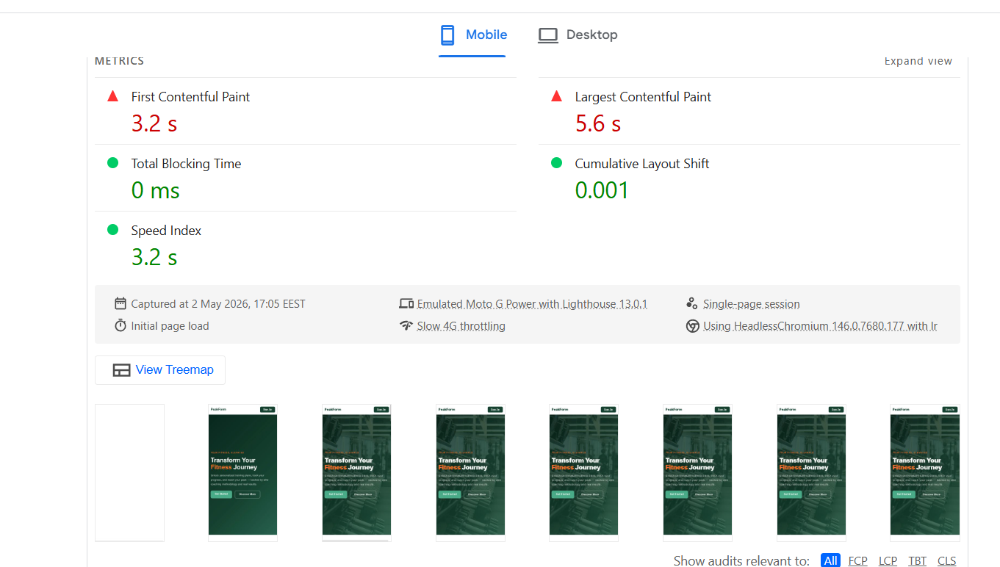

**Desktop Results**

| Category       | Score |
|----------------|-------|
| Performance    | 97    |
| Accessibility  | 74    |
| Best Practices | 100   |
| SEO            | 91    |

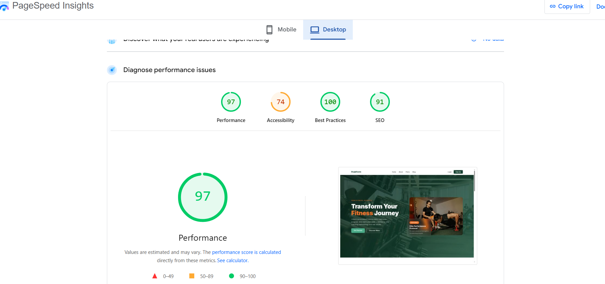

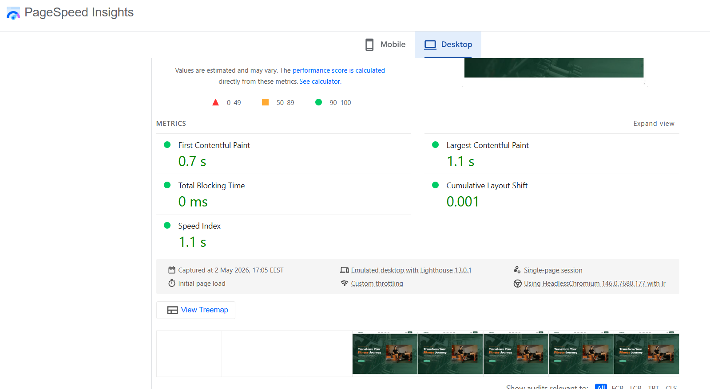

Desktop performance scores 97/100. Mobile performance is impacted by image load times on slow 4G (LCP 5.6s) — a known trade-off with externally hosted plan images.

### Manual Testing

- Manual testing was carried out on all user flows: registration, login, profile update, plan enrollment, workout logging, and dashboard display.
- User testing was performed by having real users navigate the app and provide direct feedback.

---

## Deployment

### Inception

- The project was created using a local Django setup with a virtual environment.
- Git was initialised locally and the repository was pushed to GitHub.
- The application is deployed live on [Vercel](https://vercel.com/) at [https://peak-form-iota.vercel.app/](https://peak-form-iota.vercel.app/).

Git commands used throughout development:

```
git status
git add <file>
git commit -m "message"
git push
```

### Local Clone

- Log in to GitHub and locate the PeakForm repository.
- Click **Code** and copy the HTTPS link.
- In your terminal, run:

```
git clone <copied-link>
cd PeakForm
python -m venv venv
source venv/bin/activate  # Windows: venv\Scripts\activate
pip install -r requirements.txt
cp .env.example .env      # add your SECRET_KEY and settings
python manage.py migrate
python manage.py runserver
```

### Forking repository

- Log in to GitHub and locate the PeakForm repository.
- Click the **Fork** button at the top right of the repository page.
- You will now have a copy of the repository in your own GitHub account.

---

## Credits

## Tutorials, guides and course resources

- Django Documentation — [https://docs.djangoproject.com/](https://docs.djangoproject.com/)
- Bootstrap 5 Documentation — [https://getbootstrap.com/docs/5.0/](https://getbootstrap.com/docs/5.0/)
- django-crispy-forms Documentation — [https://django-crispy-forms.readthedocs.io/](https://django-crispy-forms.readthedocs.io/)
- Code Institute Full Stack curriculum
- Django authentication system guides — various YouTube tutorials and Stack Overflow references

## Acknowledgements

A huge thank you to my mentor for the continuous support and constructive feedback throughout the project.

Thank you to the Code Institute tutoring team for their help when I was stuck.

Big Thanks.
