# PeakForm

## A full-stack fitness web application where users can create profiles, browse and enroll in training plans, and track their workout progress over time.

## Code Institute - Milestone Project 4

## HTML / CSS / JavaScript / Python / Django / SQLite - Full Stack Development Milestone Project 4.

### By RobMaty

[View Live Site](https://peak-form-iota.vercel.app/)

---

## Table of Content

* [The Why](#the-why)
* [The Business Goal](#the-business-goal)
* [(UX) User Experience](#ux-user-experience)
  + [User Stories](#user-stories)
    - [First time Users Goals](#first-time-users-goals)
    - [Returning Users Goals](#returning-users-goals)
    - [Frequent Users Goals](#frequent-users-goals)
    - [Website Owner Goals](#website-owner-goals)
* [Design](#design)
  + [Theme and Colour Scheme](#theme-and-colour-scheme)
  + [Design Brief](#design-brief)
* [Wireframes](#wireframes)
* [Features](#features)
  - [Existing Features](#existing-features)
    * [Landing Page](#landing-page)
    * [Authentication](#authentication)
    * [Training Plans](#training-plans)
    * [Plan Detail](#plan-detail)
    * [Purchase Flow](#purchase-flow)
    * [Progress Dashboard](#progress-dashboard)
* [Technologies](#technologies)
  + [Languages used](#languages-used)
  + [Frameworks, Libraries and Programs used](#frameworks-libraries-and-programs-used)
* [Database Schema](#database-schema)
  + [Entity Relationship Diagram (ERD)](#entity-relationship-diagram-erd)
  + [Models Explained](#models-explained)
  + [Relationships Overview](#relationships-overview)
* [Testing](#testing)
  + [Validator Testing](#validator-testing)
  + [Lighthouse Performance](#lighthouse-performance)
  + [Manual Testing](#manual-testing)
  + [Automated Testing](#automated-testing)
* [Deployment](#deployment)
  + [Inception](#inception)
  + [Local Clone](#local-clone)
  + [Forking repository](#forking-repository)
* [Credits](#credits)
* [Tutorials, guides and course resources](#tutorials-guides-and-course-resources)
* [Acknowledgements](#acknowledgements)

---

## The Why

Help users stay consistent with their fitness journey by giving them a centralised platform to discover structured training plans, enroll in them, and log every workout session so they can measure real progress over time.

## The Business Goal

+ Grow the user base by offering free entry-level training plans.
+ Convert free users into paying customers through premium plans.
+ Build a library of coach-created plans that coaches can sell directly through the platform.

---

## (UX) User Experience

Users can navigate the application intuitively from landing page through to plan discovery, enrollment, and daily workout logging with minimal friction.

- ### User Stories

  - #### First time Users Goals
     - To understand what PeakForm offers at a glance.
     - To register quickly and set up a personal profile.
     - To browse available training plans and filter by level.
     - To enroll in a free plan without needing payment details.

  - #### Returning Users Goals
     - To log into their account and land directly on their dashboard.
     - To view their active training plans and today's exercises.
     - To log a completed workout and track sets, reps, and weight.
     - To monitor their body weight trend over time.

  - #### Frequent Users Goals
     - To see their workout history and progress charts on the dashboard.
     - To upgrade to a premium plan as their fitness level grows.
     - To update their profile goal and body metrics.

  - #### Website Owner Goals
     - To add and manage training plans through the Django admin.
     - To assign exercises to specific days within a plan.
     - To distinguish free plans from paid plans with clear pricing.
     - To view enrolled users per plan.

---

## Design

### Theme and Colour Scheme

The theme is inspired by peak athletic performance — clean, focused, and energetic. The design uses a dark base with high-contrast accent colours to create a modern fitness aesthetic that motivates users to take action.

A minimal and bold colour scheme was chosen to communicate strength and discipline. Utility classes are applied consistently from a single CSS file to maintain visual coherence across all pages.

### Design Brief

+ Colour:

  A dark background with a vibrant primary accent communicates energy without visual noise. Secondary text uses muted tones to create clear hierarchy.

+ Images:

  Plan card images are sourced via URL and represent the physical discipline each plan targets (strength, cardio, flexibility, etc.).

+ Typography:

  A clean sans-serif font stack is used throughout to keep the interface readable and modern.

---

## Wireframes

The basic structure of PeakForm was sketched using [Balsamiq](https://balsamiq.com/).

- Landing Page (Desktop)
- Plans List (Desktop / Tablet / Mobile)
- Plan Detail Page
- Progress Dashboard
- Login / Register Forms

---

## Features

- ### Existing Features

  - #### Landing Page

    A bold hero section introduces PeakForm with a clear call-to-action to get started or discover plans. The headline immediately communicates the core value proposition. Below the hero, The Kinetic Feed section displays editorial fitness content to engage and educate users.

    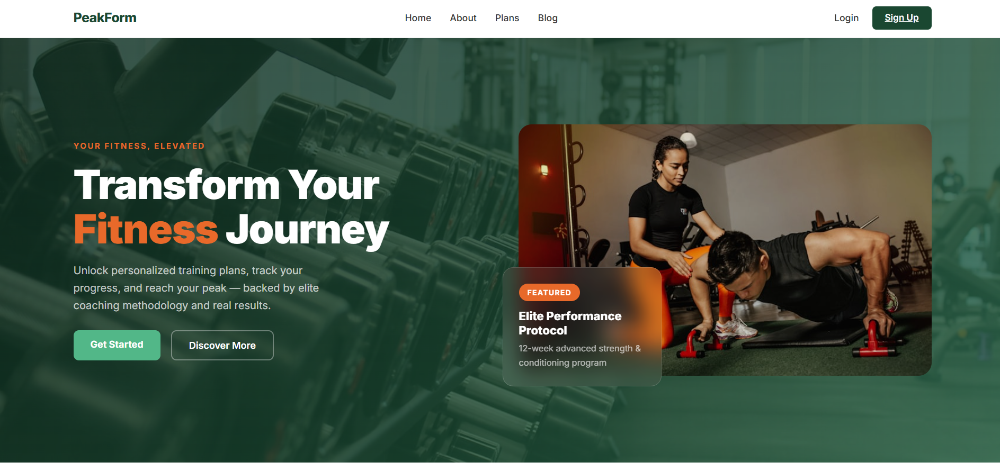

    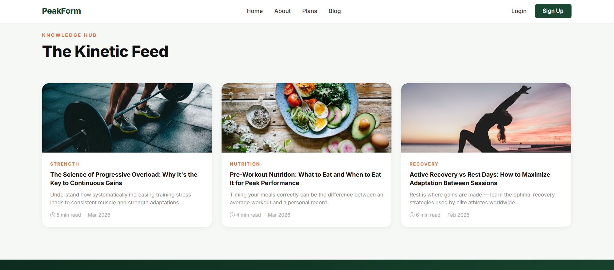

  - #### Authentication

    Users can register with a username, email, and password. Login and logout are handled securely via Django's built-in authentication. The login page is designed with a split layout featuring key selling points alongside the form.

    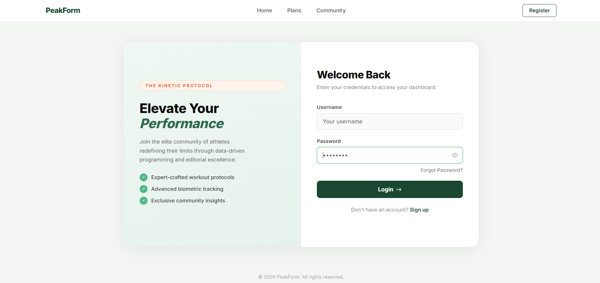

  - #### Training Plans

    All available plans are displayed as cards showing the plan title, level badge (Beginner / Intermediate / Advanced), duration in weeks, and price. Free plans are clearly labelled. Paid plans show their price. Users can search plans by name.

    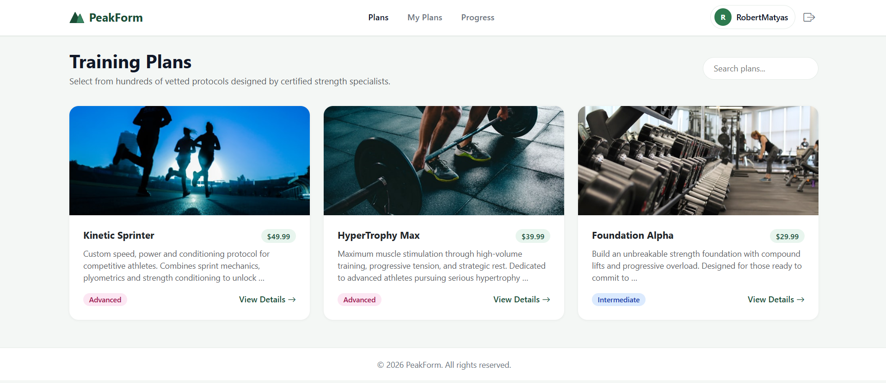

  - #### Plan Detail

    Clicking a plan opens a detail page with the full description, pricing, and exercise schedule. Exercises are grouped by day of the week and show sets, reps, rest time, and notes. A purchase button allows users to enroll in the plan.

    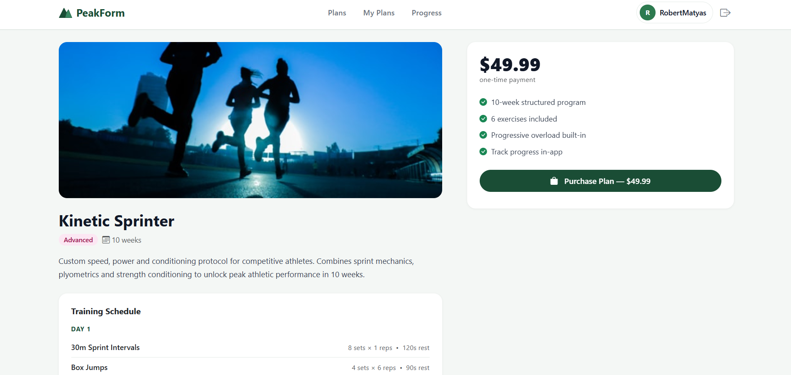

  - #### Purchase Flow

    Paid plans trigger a secure purchase modal where users enter their card details to complete the transaction before gaining access to the plan.

    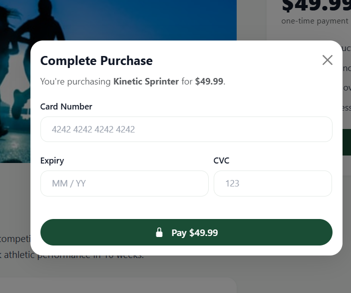

  - #### Progress Dashboard

    The dashboard shows a body weight trend chart with 7-day, 1-month, and all-time views. Users can log their current weight directly from the dashboard. A workouts panel on the right tracks all logged sessions.

    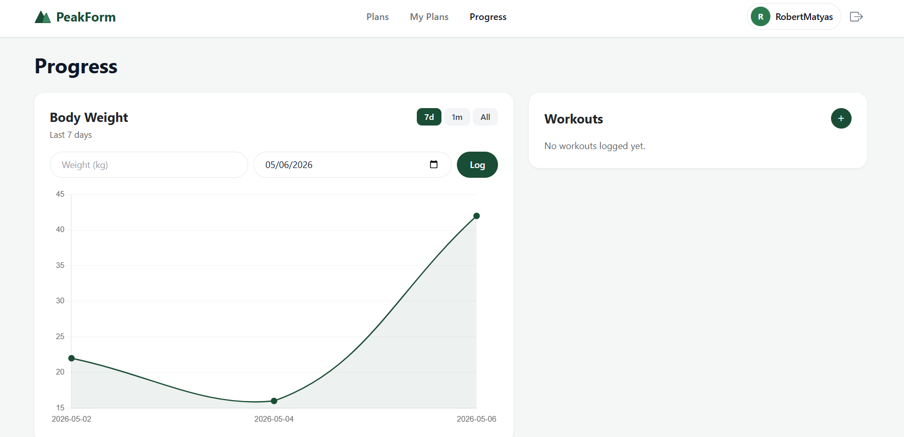

---

## Technologies

### Languages used

- [HTML5](https://en.wikipedia.org/wiki/HTML5)
- [CSS3](https://en.wikipedia.org/wiki/CSS)
- [JavaScript](https://en.wikipedia.org/wiki/JavaScript)
- [Python 3](https://en.wikipedia.org/wiki/Python_(programming_language))

### Frameworks, Libraries and Programs used

- [Django](https://www.djangoproject.com/) — main web framework (models, views, templates, ORM)
- [Bootstrap 5](https://getbootstrap.com/) — responsive layout and UI components
- [django-crispy-forms](https://django-crispy-forms.readthedocs.io/) — form rendering with Bootstrap 5 styling
- [Pillow](https://python-pillow.org/) — image processing for avatar uploads
- [python-dotenv](https://pypi.org/project/python-dotenv/) — environment variable management
- [SQLite](https://sqlite.org/) — development database
- [Git](https://git-scm.com/) — version control
- [GitHub](https://github.com/) — repository hosting
- [Balsamiq](https://balsamiq.com/) — wireframing

---

## Database Schema

PeakForm uses Django's ORM with SQLite in development and PostgreSQL in production. The data model is composed of six application models spread across three Django apps (`accounts`, `plans`, `progress`), all anchored to Django's built-in `User` model. The schema was designed around a clear separation of concerns: identity and profile data, the training-plan catalogue, and the per-user progress tracking.

### Entity Relationship Diagram (ERD)

The diagram below is rendered automatically by GitHub from a Mermaid definition. It shows every model, its key fields, and the cardinality of each relationship.

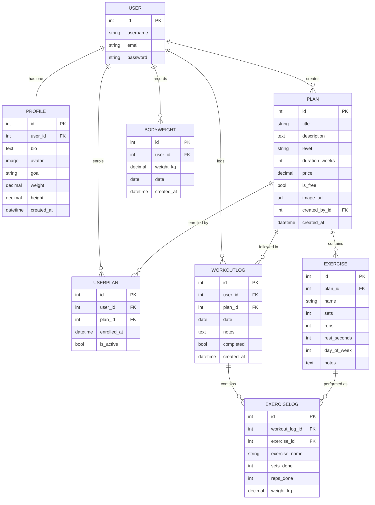
```mermaid
erDiagram
    USER ||--|| PROFILE : "has one"
    USER ||--o{ PLAN : "creates"
    USER ||--o{ USERPLAN : "enrols"
    USER ||--o{ WORKOUTLOG : "logs"
    USER ||--o{ BODYWEIGHT : "records"
    PLAN ||--o{ EXERCISE : "contains"
    PLAN ||--o{ USERPLAN : "enrolled by"
    PLAN ||--o{ WORKOUTLOG : "followed in"
    WORKOUTLOG ||--o{ EXERCISELOG : "contains"
    EXERCISE ||--o{ EXERCISELOG : "performed as"

    USER {
        int id PK
        string username
        string email
        string password
    }
    PROFILE {
        int id PK
        int user_id FK
        text bio
        image avatar
        string goal
        decimal weight
        decimal height
        datetime created_at
    }
    PLAN {
        int id PK
        string title
        text description
        string level
        int duration_weeks
        decimal price
        bool is_free
        url image_url
        int created_by_id FK
        datetime created_at
    }
    EXERCISE {
        int id PK
        int plan_id FK
        string name
        int sets
        int reps
        int rest_seconds
        int day_of_week
        text notes
    }
    USERPLAN {
        int id PK
        int user_id FK
        int plan_id FK
        datetime enrolled_at
        bool is_active
    }
    WORKOUTLOG {
        int id PK
        int user_id FK
        int plan_id FK
        date date
        text notes
        bool completed
        datetime created_at
    }
    EXERCISELOG {
        int id PK
        int workout_log_id FK
        int exercise_id FK
        string exercise_name
        int sets_done
        int reps_done
        decimal weight_kg
    }
    BODYWEIGHT {
        int id PK
        int user_id FK
        decimal weight_kg
        date date
        datetime created_at
    }
```

### Models Explained

Each model below lists its purpose, its most important fields, and how it connects to the rest of the schema.

| Model | App | Purpose | Key Relationships |
|-------|-----|---------|-------------------|
| **Profile** | accounts | Extends the built-in `User` with fitness-specific data: a short bio, an avatar image, the user's training goal, and current body metrics (weight/height). | `OneToOne` with `User` — every user has exactly one profile, created automatically on registration via a `post_save` signal. |
| **Plan** | plans | Represents a training plan in the catalogue, including its title, description, difficulty level, duration in weeks, price, and whether it is free. | `ForeignKey` to `User` (`created_by`) — the coach/owner who authored the plan. One plan has many exercises and can be enrolled in by many users. |
| **Exercise** | plans | A single exercise that belongs to a plan, with prescribed sets, reps, rest time, and the day of the week it is scheduled for. | `ForeignKey` to `Plan` — many exercises belong to one plan (`CASCADE` delete). |
| **UserPlan** | plans | The enrolment link between a user and a plan. Tracks when the user enrolled and whether the enrolment is still active. | `ForeignKey` to both `User` and `Plan`, with a `unique_together` constraint so a user cannot enrol in the same plan twice. This is the join model that resolves the many-to-many relationship between users and plans. |
| **WorkoutLog** | progress | A single logged workout session for a user on a given date, with notes and a completion flag. The `date` field is validated to reject future dates. | `ForeignKey` to `User` (the owner) and an optional `ForeignKey` to `Plan` (the plan being followed, `SET_NULL` on delete). One workout log has many exercise logs. |
| **ExerciseLog** | progress | The performance record of one exercise within a workout session — the actual sets, reps, and weight the user completed. | `ForeignKey` to `WorkoutLog` (`CASCADE`) and an optional `ForeignKey` to `Exercise` (`SET_NULL`). Stores `exercise_name` directly so history is preserved even if the source exercise is removed. |
| **BodyWeight** | progress | A single body-weight measurement for a user on a given date, used to render the progress trend chart. The `date` field is validated to reject future dates. | `ForeignKey` to `User` — a user has many measurements over time. |

### Relationships Overview

- **User → Profile** (One-to-One): each user has exactly one profile holding their personal fitness information.
- **User → Plan** (One-to-Many): a user (acting as a coach) can author many plans via `created_by`.
- **User ↔ Plan** (Many-to-Many through UserPlan): a user can enrol in many plans and a plan can be taken by many users; the `UserPlan` model carries the enrolment metadata.
- **Plan → Exercise** (One-to-Many): a plan is made up of many scheduled exercises.
- **User → WorkoutLog** (One-to-Many): a user logs many workout sessions over time.
- **WorkoutLog → ExerciseLog** (One-to-Many): each logged session contains the individual exercises performed in it.
- **Exercise → ExerciseLog** (One-to-Many): a catalogue exercise can be referenced by many performance records.
- **User → BodyWeight** (One-to-Many): a user records many body-weight measurements over time.

---

## Testing

### Validator Testing

Site-wide HTML and standards validation was carried out using [PowerMapper SortSite](https://www.powermapper.com/products/sortsite/). The tool scanned all 17 pages and files across the application and reported 0 broken links or errors. Standards compliance scored well above average (6% issues vs benchmark).

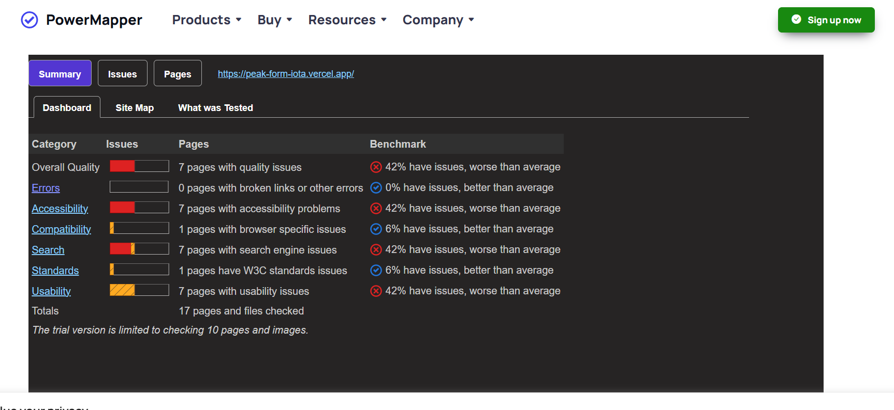

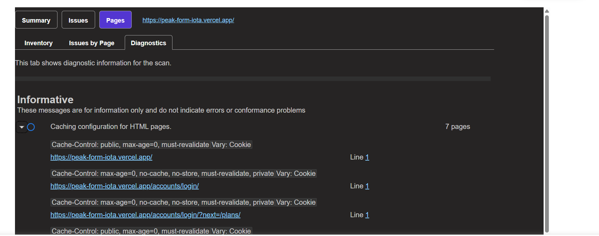

CSS was additionally validated using the [W3C CSS Validation Service](https://jigsaw.w3.org/css-validator/).

### Lighthouse Performance

Performance was measured using [Google PageSpeed Insights](https://pagespeed.web.dev/) on the landing page.

**Mobile Results**

| Category       | Score |
|----------------|-------|
| Performance    | 73    |
| Accessibility  | 74    |
| Best Practices | 100   |
| SEO            | 91    |

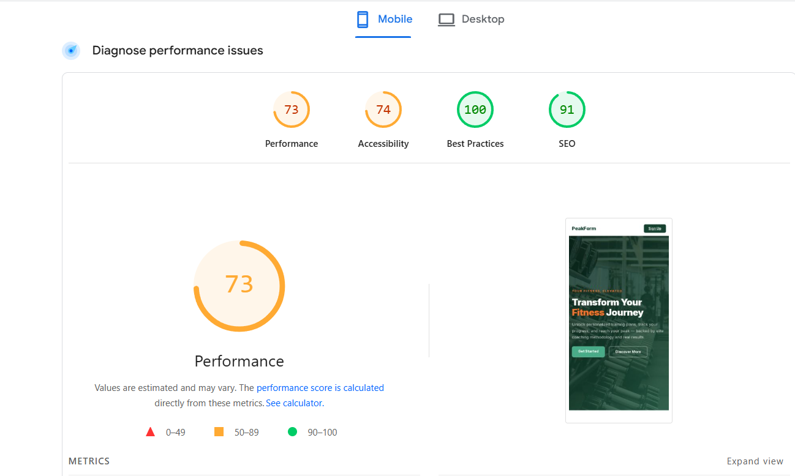

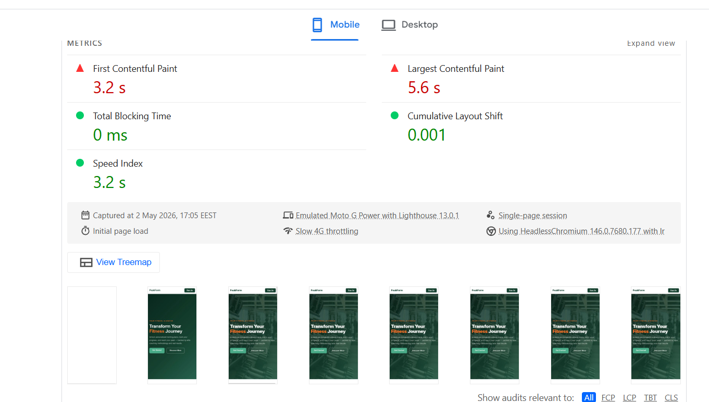

**Desktop Results**

| Category       | Score |
|----------------|-------|
| Performance    | 97    |
| Accessibility  | 74    |
| Best Practices | 100   |
| SEO            | 91    |

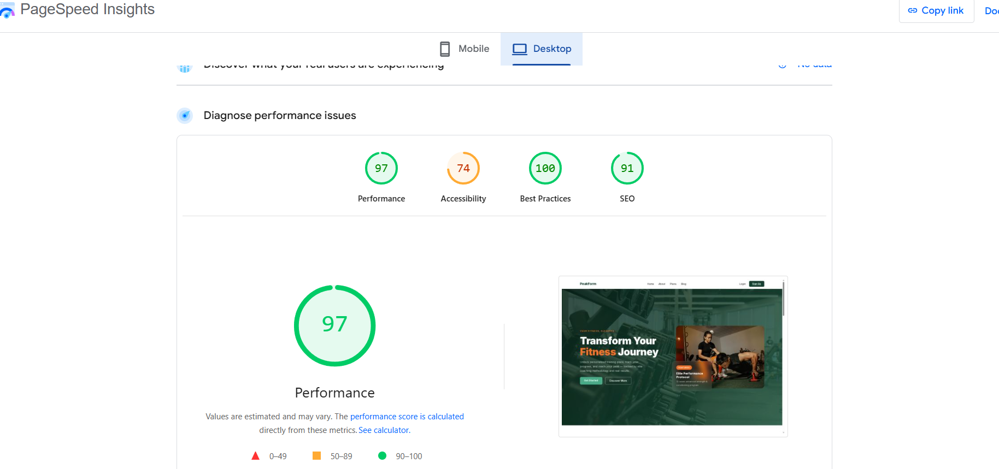

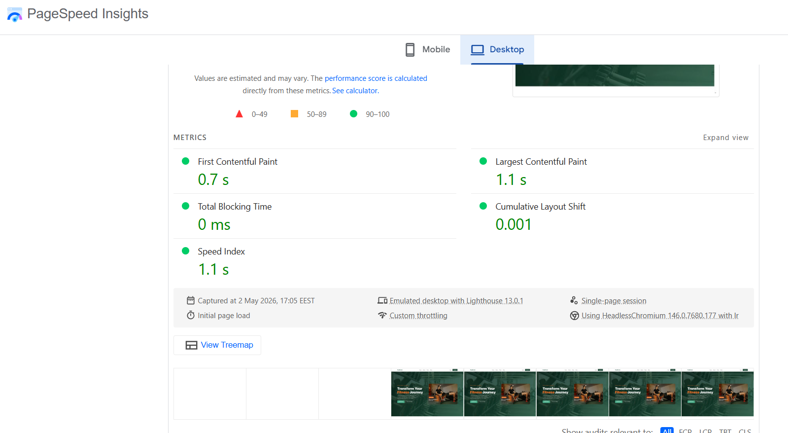

Desktop performance scores 97/100. Mobile performance is impacted by image load times on slow 4G (LCP 5.6s) — a known trade-off with externally hosted plan images.

### Manual Testing

Manual testing was carried out across every user flow. Each feature was tested with both valid and, where relevant, invalid input. The table below records the test performed, the expected result, the actual result, and the pass/fail outcome.

| Feature | Test Performed | Expected Result | Actual Result | Pass/Fail |
|---------|----------------|-----------------|---------------|-----------|
| User Registration | Register with valid username, email and matching passwords | Account is created, user is logged in and redirected | Account created and user redirected to home | Pass |
| User Registration | Register with mismatched passwords | Validation error shown, no account created | Validation error displayed, account not created | Pass |
| User Login | Login with valid credentials | User is authenticated and redirected to the app | User logged in successfully | Pass |
| User Login | Login with an incorrect password | Login fails and an error message is shown | Error message displayed, access denied | Pass |
| Profile Update | Change goal, bio and body metrics | Updated details are saved and shown | Details saved correctly | Pass |
| Plan Browsing | Open the plans page as a logged-in user | All available plans are listed | Plans displayed as cards | Pass |
| Plan Detail | Open a plan and view its exercise schedule | Plan description and exercises shown by day | Detail and schedule rendered correctly | Pass |
| Plan Enrolment | Enrol in a training plan | Plan is assigned to the user | Plan assigned successfully | Pass |
| Plan Enrolment | Click enrol again on the same plan | User is un-enrolled (toggle off) | Enrolment removed successfully | Pass |
| Workout Logging | Add a workout with a valid date | Workout is stored in the database | Workout recorded correctly | Pass |
| Workout Logging | Try to log a workout with a future date | Submission is rejected with a validation message | Future date rejected, no record created | Pass |
| Weight Logging | Add a body-weight entry with a valid date | Entry is saved and the chart updates | Weight saved and trend chart refreshed | Pass |
| Weight Logging | Try to log a weight with a future date | Submission is rejected with a validation message | Future date rejected, no record created | Pass |
| Form Validation | Submit a form with missing required fields | Validation message displayed | Validation message displayed | Pass |
| Access Control | Open the dashboard while logged out | User is redirected to the login page | Redirected to login as expected | Pass |

In addition, user testing was performed by having real users navigate the app and provide direct feedback on usability.

### Automated Testing

Automated tests were written using Django's built-in test framework (`django.test.TestCase`), which runs against an isolated, throwaway test database. The suite covers the models (including the new future-date validation), the forms, the authentication flows, and the JSON/AJAX endpoints across all three apps.

Run the full suite with:

```
python manage.py test
```

Coverage by app:

| App | Tests Cover |
|-----|-------------|
| accounts | Profile auto-creation signal, `Profile.__str__`, registration form validation (valid and mismatched passwords), the register view, login (valid and invalid credentials), and authenticated profile updates. |
| plans | `Plan` and `Exercise` string representations, the plan→exercise relationship, public vs. login-protected views, plan detail rendering, and plan enrolment (enrol, toggle off, and rejection of non-AJAX requests). |
| progress | The `validate_not_future` validator, model-level rejection of future dates on `WorkoutLog` and `BodyWeight`, the `log_workout` and `log_weight` endpoints (accepting valid dates and rejecting future ones), login protection, and the weight-history endpoint. |

All 31 tests pass:

```
Ran 31 tests in ... s

OK
```

The tests were added and committed alongside the features they cover, reflecting a test-driven approach that is traceable through the Git commit history.

---

## Deployment

### Inception

- The project was created using a local Django setup with a virtual environment.
- Git was initialised locally and the repository was pushed to GitHub.
- The application is deployed live on [Vercel](https://vercel.com/) at [https://peak-form-iota.vercel.app/](https://peak-form-iota.vercel.app/).

Git commands used throughout development:

```
git status
git add <file>
git commit -m "message"
git push
```

### Local Clone

- Log in to GitHub and locate the PeakForm repository.
- Click **Code** and copy the HTTPS link.
- In your terminal, run:

```
git clone <copied-link>
cd PeakForm
python -m venv venv
source venv/bin/activate  # Windows: venv\Scripts\activate
pip install -r requirements.txt
cp .env.example .env      # add your SECRET_KEY and settings
python manage.py migrate
python manage.py runserver
```

### Forking repository

- Log in to GitHub and locate the PeakForm repository.
- Click the **Fork** button at the top right of the repository page.
- You will now have a copy of the repository in your own GitHub account.

---

## Credits

## Tutorials, guides and course resources

- Django Documentation — [https://docs.djangoproject.com/](https://docs.djangoproject.com/)
- Bootstrap 5 Documentation — [https://getbootstrap.com/docs/5.0/](https://getbootstrap.com/docs/5.0/)
- django-crispy-forms Documentation — [https://django-crispy-forms.readthedocs.io/](https://django-crispy-forms.readthedocs.io/)
- Code Institute Full Stack curriculum
- Django authentication system guides — various YouTube tutorials and Stack Overflow references

## Acknowledgements

A huge thank you to my mentor for the continuous support and constructive feedback throughout the project.

Thank you to the Code Institute tutoring team for their help when I was stuck.

Big Thanks.
